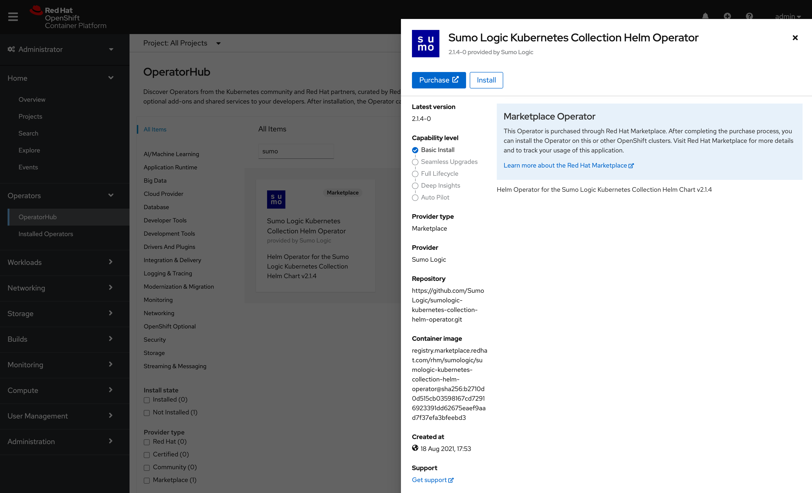
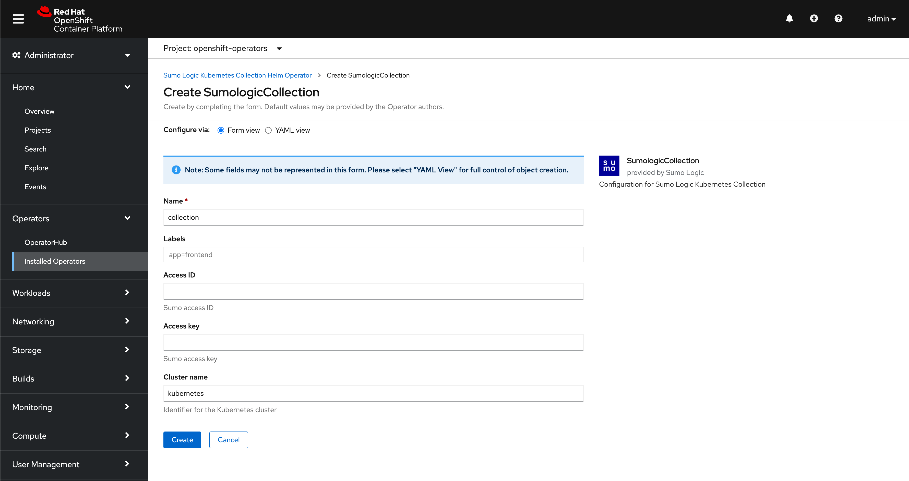

# Test Instruction

## Test Helm Operator using local instance of OperatorHub on OpenShift

1. (Optional) Build and push to container registry catalog image

   This is an optional step, you can use also existing container images, please see information about
   [official container images](../container_images.md) and [developer container images](container_images.md).

   First, render the bundle into the FBC catalog directory, then build and push the catalog image:

   ```bash
   make catalog-render-fbc BUNDLE_IMGS=<BUNDLE_IMAGE>
   make catalog-build-fbc catalog-push CATALOG_IMG=<CATALOG_IMAGE>
   ```

   e.g.

   ```bash
   make catalog-render-fbc \
       BUNDLE_IMGS=public.ecr.aws/sumologic/sumologic-kubernetes-collection-helm-operator-bundle:4.21.0-0

   make catalog-build-fbc catalog-push \
       CATALOG_IMG=public.ecr.aws/sumologic/sumologic-kubernetes-collection-helm-operator-catalog:fbc-test
   ```

   **Notice**: Operator Package Manager (OPM) is required. Run `make opm` to download it locally.
   When building on Apple Silicon (arm64) for an amd64 cluster, use `docker buildx` with `--platform linux/amd64 --provenance=false`.

1. Create `CatalogSource` e.g.

   ```bash
   kubectl apply -f tests/catalogsource.yaml
   ```

   **Notice**: Example `CatalogSource` can be found as [tests/catalogsource.yaml](../../tests/catalogsource.yaml).
   Please remember to update catalog image in definition of `CatalogSource`.

1. Check that `CatalogSource` was created e.g.

   ```bash
   $ kubectl get CatalogSource -n openshift-marketplace
   NAME                              DISPLAY                    TYPE   PUBLISHER    AGE
   certified-operators               Certified Operators        grpc   Red Hat      57m
   community-operators               Community Operators        grpc   Red Hat      57m
   redhat-marketplace                Red Hat Marketplace        grpc   Red Hat      57m
   redhat-operators                  Red Hat Operators          grpc   Red Hat      57m
   sumologic-helm-operator-catalog   Sumo Logic Helm Operator   grpc   Sumo Logic   37s
   ```

1. Check that Pod for `sumologic-helm-operator-catalog` was created in `openshift-marketplace`  namespace e.g.

   ```bash
   $ kubectl get pods -n openshift-marketplace
   NAME                                      READY   STATUS    RESTARTS   AGE
   certified-operators-zhjl4                 1/1     Running   0          68m
   community-operators-sf8q6                 1/1     Running   0          68m
   marketplace-operator-5bbff88564-zc8bs     1/1     Running   0          75m
   redhat-marketplace-8dvnb                  1/1     Running   0          68m
   redhat-operators-jt64g                    1/1     Running   0          68m
   sumologic-helm-operator-catalog-pd5t9     1/1     Running   0          11m
   ```

1. Go to OpenShift web-console and install Sumo Logic Helm Operator from local instance of OperatorHub on OpenShift.

 

1. Create instance of `SumologicCollection` with proper configuration, please see [Configuration](../../README.md#configuration) section and [example configurations](../../config/samples/) for more details.

  