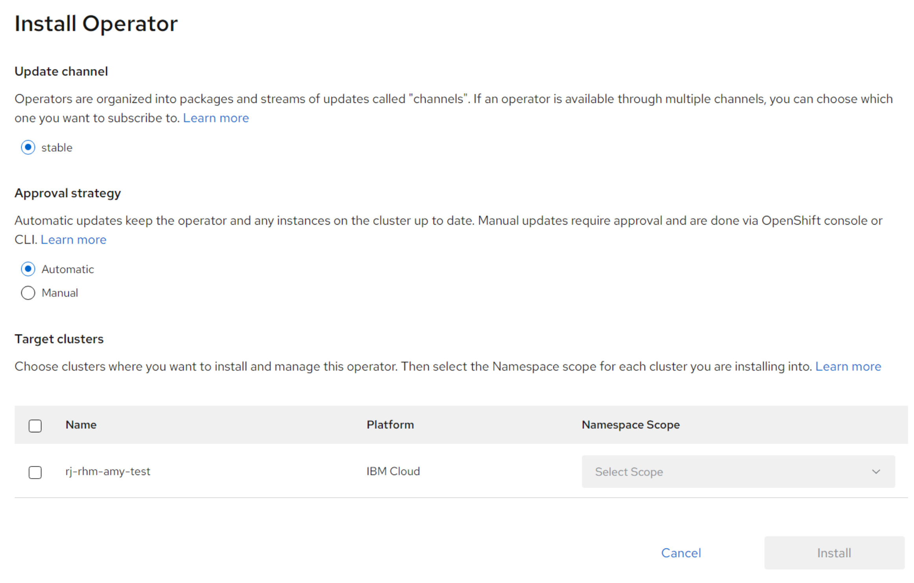
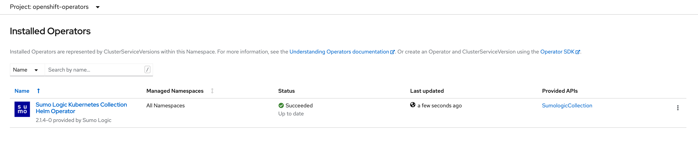
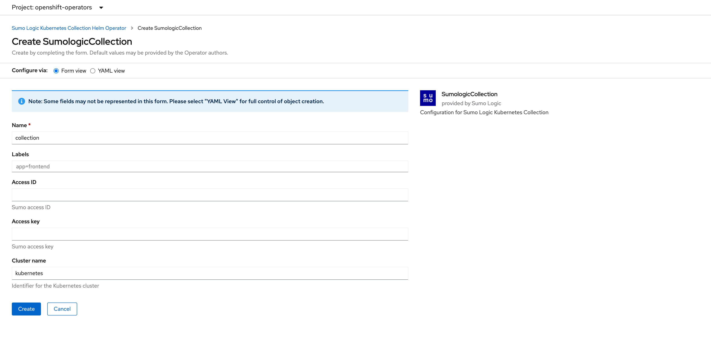
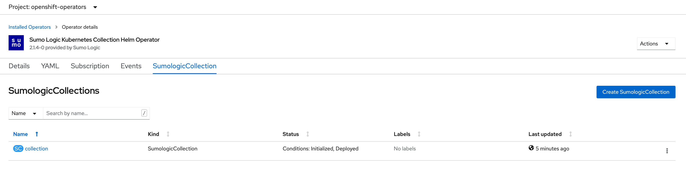

# Installation from Red Hat Marketplace

## Prerequisites

- If you don’t already have a Sumo account, you can create one by clicking the Free Trial button on https://www.sumologic.com/.
  To set up Sumo Logic Kubernetes collection it is required to have an [Access ID and Access Key][access_keys]
  with [Manage Collectors][role_capabilities] capability.

- Sumo Logic Kubernetes Collection Helm Operator deploys [Sumo Logic Kubernetes Collection Helm Chart][helm-chart-repo] so before starting with Sumo Logic Kubernetes Collection Helm Operator please review [documentation][helm-docs] for Helm chart.

- To interact with Kubernetes cluster please install [kubectl][kubectl_install] or [OpenShift CLI][oc_install].

[access_keys]: https://help.sumologic.com/Manage/Security/Access-Keys
[role_capabilities]: https://help.sumologic.com/Manage/Users-and-Roles/Manage-Roles/05-Role-Capabilities#data-management
[helm-chart-repo]: https://github.com/SumoLogic/sumologic-kubernetes-collection
[helm-docs]: https://github.com/SumoLogic/sumologic-kubernetes-collection/tree/release-v2.1/deploy/docs
[kubectl_install]: https://kubernetes.io/docs/tasks/tools/install-kubectl-linux/
[oc_install]: https://docs.openshift.com/container-platform/4.7/cli_reference/openshift_cli/getting-started-cli.html

## Operator installation from Red Hat Marketplace

1. For information on registering your cluster and creating a namespace, see [Red Hat
Marketplace Docs][red-hat-marketplace-docs]. This must be done prior to operator install.
1. On the main menu, click **Workspace > My Software > product > Install Operator**.
1. On the **Update Channel** section, select an option.
1. On the **Approval Strategy** section, select either **Automatic** or **Manual**. The approval strategy corresponds
   to how you want to process operator upgrades.
1. On the **Target Cluster** section:

   - Click the checkbox next to the clusters where you want to install the Operator.
   - For each cluster you selected, under **Namespace Scope**, on the Select **Scope** list, select an option.

1. Click **Install**. It may take several minutes for installation to complete.
1. Once installation is complete, the status will change from **installing** to **Up to date**.
1. For further information, see the [Red Hat Marketplace Operator documentation][red-hat-marketplace-operator-docs].

[red-hat-marketplace-docs]: https://marketplace.redhat.com/en-us/documentation/clusters
[red-hat-marketplace-operator-docs]: https://marketplace.redhat.com/en-us/documentation/operators



## Verification of operator installation

1. Once status changes to Up to date, click the vertical ellipses `⋮` and select Cluster Console.
1. Open the cluster where you installed the product
1. Go to **Operators > Installed Operators**
1. Select the Namespace or Project you installed on
1. Verify status for product is **Succeeded**
1. Click the product name to open details



## Installation of Sumo Logic Kubernetes Collection

Configuration for Sumo Logic Kubernetes Collection Helm Operator needs to be provided in `SumologicCollection` resource.
Custom Resource Definition for `SumologicCollection` is defined in
[helm-operator.sumologic.com_sumologiccollections.yaml][crd].

`SumologicCollection.spec` allows to configure all parameters from [values.yaml][values.yaml] for the
[Sumo Logic Kubernetes Collection Helm Chart][helm-chart-repo].
All possible parameters with descriptions can be found in [Configuration][helm-chart-configuration]
section for Sumo Logic Kubernetes Collection Helm Chart.

Example configurations for Sumo Logic Kubernetes Collection Helm Operator are available in [config/samples](../config/samples) directory.

[helm-chart-repo]: https://github.com/SumoLogic/sumologic-kubernetes-collection
[helm-chart-configuration]: https://github.com/SumoLogic/sumologic-kubernetes-collection/blob/release-v2.1/deploy/helm/sumologic/README.md#configuration
[crd]: ../config/crd/bases/helm-operator.sumologic.com_sumologiccollections.yaml
[values.yaml]: https://github.com/SumoLogic/sumologic-kubernetes-collection/blob/release-v2.1/deploy/helm/sumologic/values.yaml

Minimal set of parameters for Sumologic Collection can be provided via **Form View**:



other configuration options can be configured in **YAML View**.

To deploy Sumo Logic Kubernetes Collection please set configuration parameters and
create `SumologicCollection` resource by clicking **Create** button.

## Verification

When Sumo Logic Kubernetes Collection is correctly deployed in the cluster then status should be set as **Conditions: Initialized, Deployed**:



For default configuration you should see similar list of Pods:

```bash
$ kubectl get pods -n openshift-operators
NAME                                                   READY   STATUS    RESTARTS   AGE
collection-fluent-bit-2hgvs                            1/1     Running   0          3m42s
collection-fluent-bit-2slb4                            1/1     Running   0          3m42s
collection-fluent-bit-4p2km                            1/1     Running   0          3m42s
collection-fluent-bit-5rkwn                            1/1     Running   0          3m42s
collection-fluent-bit-7mpsl                            1/1     Running   0          3m41s
collection-fluent-bit-fzvzv                            1/1     Running   0          3m42s
collection-fluent-bit-j4xbh                            1/1     Running   0          3m41s
collection-fluent-bit-qvklb                            1/1     Running   0          3m42s
collection-kube-prometheus-operator-7dddffd7cf-jp4qp   1/1     Running   0          3m42s
collection-kube-state-metrics-864f877555-khjzv         1/1     Running   0          3m42s
collection-prometheus-node-exporter-5smcs              1/1     Running   0          3m42s
collection-prometheus-node-exporter-6qd6b              1/1     Running   0          3m41s
collection-prometheus-node-exporter-8gl59              1/1     Running   0          3m41s
collection-prometheus-node-exporter-g67ws              1/1     Running   0          3m41s
collection-prometheus-node-exporter-hgfsw              1/1     Running   0          3m41s
collection-prometheus-node-exporter-qpnfv              1/1     Running   0          3m42s
collection-prometheus-node-exporter-xkcjn              1/1     Running   0          3m42s
collection-prometheus-node-exporter-z6z9b              1/1     Running   0          3m41s
collection-sumologic-fluentd-events-0                  1/1     Running   0          3m41s
collection-sumologic-fluentd-logs-0                    1/1     Running   0          3m41s
collection-sumologic-fluentd-logs-1                    1/1     Running   0          3m41s
collection-sumologic-fluentd-logs-2                    1/1     Running   0          3m41s
collection-sumologic-fluentd-metrics-0                 1/1     Running   0          3m41s
collection-sumologic-fluentd-metrics-1                 1/1     Running   0          3m41s
collection-sumologic-fluentd-metrics-2                 1/1     Running   0          3m41s
prometheus-collection-kube-prometheus-prometheus-0     3/3     Running   1          3m22s
sumologic-helm-operator-84678d8744-qlclc               2/2     Running   0          64m
```

## Viewing Data In Sumo Logic

Once you have completed installation, you can [install the Kubernetes App and view the dashboards][install_apps]
or [open a new Explore tab][k8s_tab] in Sumo Logic.

[install_apps]: https://help.sumologic.com/07Sumo-Logic-Apps/10Containers_and_Orchestration/Kubernetes/Install_the_Kubernetes_App%2C_Alerts%2C_and_view_the_Dashboards
[k8s_tab]: https://help.sumologic.com/Observability_Solution/Kubernetes_Solution/Navigate_your_Kubernetes_environment
